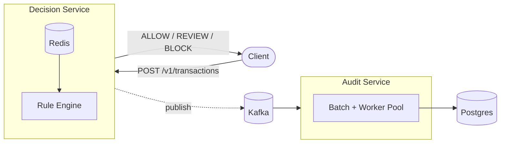
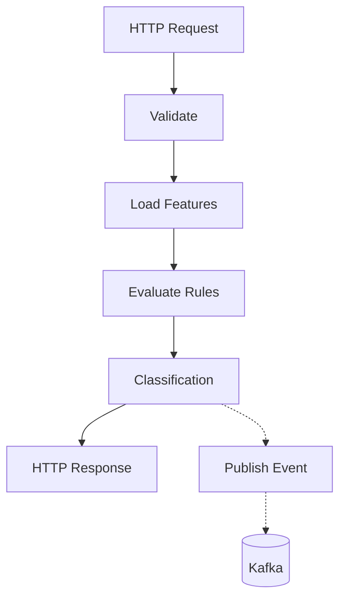
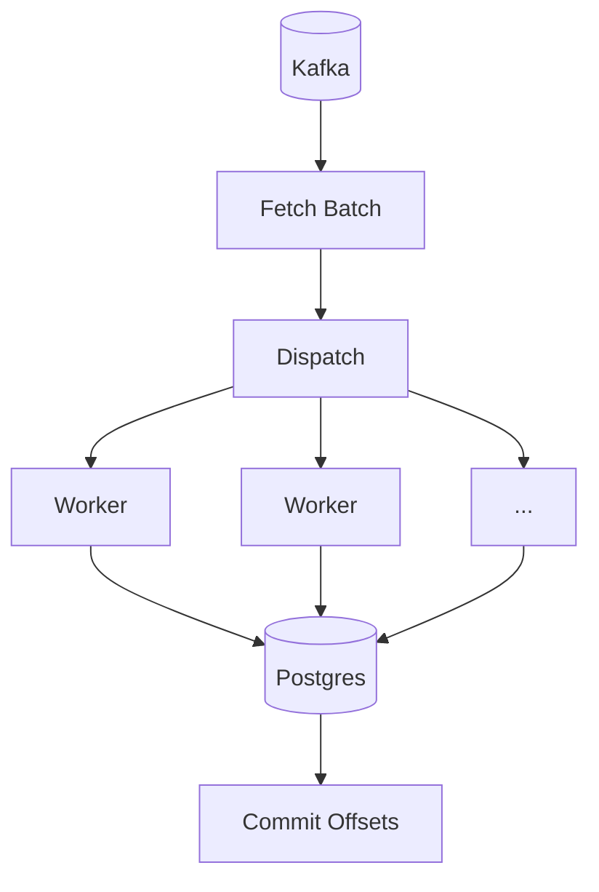

# Architecture

This document explains the design of Vergil and the reasoning behind the major implementation choices.

The system has two responsibilities:

1. Make a transaction decision with low and predictable latency.
2. Record every decision without increasing request latency.

These responsibilities are handled by separate services.



The API is responsible for serving requests. The consumer is responsible for persistence.

This separation allows the request path to remain independent of PostgreSQL while still producing a durable audit trail.

---

# Components

| Component  | Responsibility            |
| ---------- | ------------------------- |
| Go         | API and consumer services |
| Redis      | Feature computation       |
| Kafka      | Event transport           |
| PostgreSQL | Audit storage             |
| Prometheus | Metrics                   |
| pprof      | CPU profiling             |
| k6         | Load testing              |

The project deliberately keeps the request path small. During request processing the API communicates only with Redis and Kafka. PostgreSQL is accessed exclusively by the consumer.

---

# Decision Path



Each request follows four steps:

1. Compute user features from Redis.
2. Evaluate the configured rules.
3. Return a classification.
4. Publish an audit event asynchronously.

Returning the response does not depend on PostgreSQL.

## Feature computation

The request path currently computes two features.

| Feature   | Implementation             |
| --------- | -------------------------- |
| Velocity  | Redis sorted set           |
| AmountSum | Redis fixed-window counter |

Velocity uses a sorted set (`ZADD`, `ZREMRANGEBYSCORE`, `ZCARD`) to maintain an exact sliding window.

AmountSum uses fixed-window counters (`INCRBYFLOAT`). This requires less memory but introduces window boundaries. The project intentionally uses different approaches because the two features have different accuracy requirements.

Both features are collected through a single Redis pipeline.

Originally they were implemented as two separate pipelines. CPU profiling showed the additional network round trip dominating request latency, so they were merged into `feature.Snapshot()`.

## Rule engine

Rules implement a common interface.

```go
type Rule interface {
    Evaluate(Features) float64
    Name() string
}
```

Each rule contributes a score independently.

The final score is mapped to one of three classifications:

- ALLOW
- REVIEW
- BLOCK

Adding a rule requires implementing the interface and registering it with the scorer. Existing rules do not need to change.

## Event publication

After a decision is produced, the API publishes a `DecisionEvent` to Kafka.

Publishing is asynchronous.

The request is completed before the audit record is written to PostgreSQL. This keeps request latency independent of database write latency.

---

# Audit Pipeline

The consumer is responsible for turning Kafka events into durable audit records.



The pipeline processes messages in batches rather than one at a time. Each batch is distributed across a bounded worker pool and committed only after every message has been written successfully.

## Worker pool

Each batch creates:

- a dispatch channel
- a fixed number of workers
- a `WaitGroup`

Workers consume messages from the dispatch channel until the batch is exhausted. The `WaitGroup` acts as the synchronization point before offsets are committed.

The worker count is intentionally bounded.

When PostgreSQL becomes slower than Kafka, backlog accumulates in Kafka rather than creating an unbounded number of goroutines or database connections.

## Commit ordering

Kafka offsets are committed only after every message in the batch has been written successfully.

```text
Fetch batch
     │
     ▼
Write to Postgres
     │
     ▼
Commit offsets
```

Committing offsets before persistence risks acknowledging messages that were never written.

Committing after persistence means a crash may replay previously written messages. To make replay safe, inserts use:

```sql
ON CONFLICT (txn_id) DO NOTHING
```

The combination of commit-after-write and idempotent inserts provides at-least-once processing without requiring distributed transactions.

## Failure handling

The consumer distinguishes between recoverable and unrecoverable failures.

| Failure                | Behaviour                          |
| ---------------------- | ---------------------------------- |
| PostgreSQL write fails | Batch is retried                   |
| Worker panic           | Recovered, batch retried           |
| Consumer crash         | Kafka redelivers uncommitted batch |
| Invalid event payload  | Logged and skipped                 |

Worker panics are recovered inside the worker rather than terminating the process. A single faulty message should not stop the consumer from processing subsequent batches.

Invalid payloads are treated differently because retrying malformed data would never succeed.

---

# Graceful Shutdown

Both services listen for `SIGINT` and `SIGTERM`.

## API

Shutdown proceeds in this order:

1. Stop accepting new requests.
2. Finish in-flight requests.
3. Flush the Kafka writer.
4. Exit.

Closing the Kafka writer before request completion could discard events generated by requests that were already being processed.

## Consumer

The consumer stops fetching new batches after shutdown begins.

If a batch has already been fetched, processing continues until either:

- the batch completes successfully, or
- the drain timeout expires.

This avoids abandoning messages that have already been removed from Kafka but not yet persisted.

---

# Data Model

```sql
CREATE TABLE decisions (
    txn_id         TEXT PRIMARY KEY,
    user_id        TEXT NOT NULL,
    classification TEXT NOT NULL,
    score          DOUBLE PRECISION NOT NULL,
    reasons        TEXT[] NOT NULL DEFAULT '{}',
    decided_at     TIMESTAMPTZ NOT NULL,
    created_at     TIMESTAMPTZ NOT NULL DEFAULT now()
);
```

`txn_id` uniquely identifies a decision and makes duplicate processing harmless through `ON CONFLICT DO NOTHING`.

Reasons are stored as a native PostgreSQL array because they are written and queried together with the decision.

---

# Performance

Performance measurements were collected with **k6** while profiling the API with **pprof**.

| Metric      |          Result |
| ----------- | --------------: |
| Throughput  | **4,582 req/s** |
| p50 latency |      **6.0 ms** |
| p95 latency |     **22.2 ms** |
| p99 latency |     **42.0 ms** |

CPU profiling identified two sequential Redis pipelines as the largest contributor to request latency. Combining them into a single pipeline increased throughput from **2,249 req/s** to **4,582 req/s**.


During sustained load, the API was able to produce events faster than the consumer could persist them. Kafka absorbed the backlog until the consumer caught up.

Peak observed lag during testing:

**146,900 messages**


---

# Observability

The system exposes metrics from both services.

| Service  | Endpoint                   |
| -------- | -------------------------- |
| API      | `/metrics`, `/debug/pprof` |
| Consumer | `/metrics`                 |

Collected metrics include:

- Request latency
- Decision counts
- Batch processing duration
- Messages processed
- Kafka consumer lag
- Worker pool size

Structured logging uses `log/slog` with configurable log levels.

---

# Limitations

The current implementation intentionally leaves out several production concerns.

- Single Kafka partition.
- Single PostgreSQL instance.
- No dead-letter queue for malformed events.
- No schema migration framework.
- Rules are statically configured.

These choices keep the project focused on the request path, asynchronous persistence, and reliability model rather than infrastructure management.

---

# Summary

Vergil is an exploration of a common backend pattern: separating request latency from persistence.

The project focuses on predictable request latency, asynchronous processing, and measurable system behaviour. Every major implementation choice—from Redis pipelines to commit ordering and worker pool design—was made to support those goals and is backed by profiling or observed behaviour rather than assumptions.