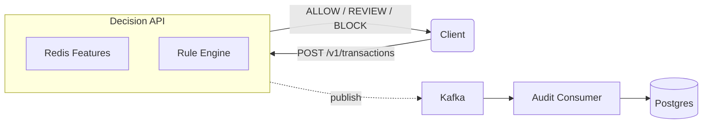
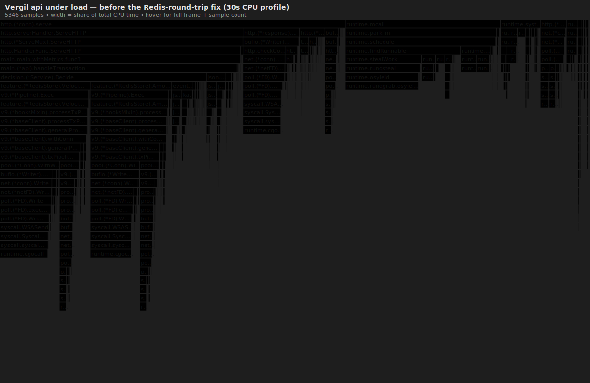
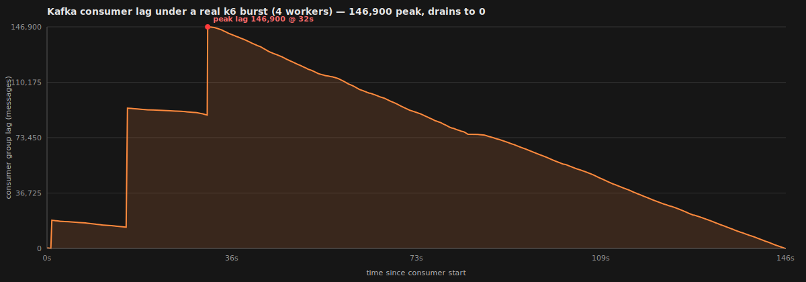

# Vergil


Vergil is a transaction decision service built around a simple design goal:

> **The request path should not wait for persistence.**

Each request is evaluated synchronously using data stored in Redis. The resulting decision is returned immediately, while the audit record is published to Kafka and written to PostgreSQL by a separate consumer.

This keeps request latency independent of database performance while still producing a durable audit trail.



---

## Overview

The repository contains two independent services.

| Component      | Responsibility                                                                                                     |
| -------------- | ------------------------------------------------------------------------------------------------------------------ |
| `cmd/api`      | Accept transactions, compute features, evaluate rules, return a decision, publish an audit event.                  |
| `cmd/consumer` | Consume audit events from Kafka, batch writes, persist them to PostgreSQL, commit offsets after successful writes. |

The API never writes to PostgreSQL directly.

The consumer never participates in request handling.

---

## Features

- Request path isolated from PostgreSQL
- Kafka-backed asynchronous audit pipeline
- Redis-based feature computation
- Bounded worker pool
- Batch processing
- Commit-after-write offset management
- At-least-once delivery
- Idempotent persistence
- Graceful shutdown
- Prometheus metrics
- pprof profiling
- Structured logging

---

## Performance

Benchmarks were collected using **k6** and **pprof** on a local development machine.

| Metric      |          Result |
| ----------- | --------------: |
| Throughput  | **4,582 req/s** |
| p50 latency |      **6.0 ms** |
| p95 latency |     **22.2 ms** |
| p99 latency |     **42.0 ms** |

Profiling identified two sequential Redis pipelines in the request path as the dominant cost. Combining them into a single pipeline increased throughput from **2,249 req/s** to **4,582 req/s**.

### CPU profile



### Kafka lag during sustained load

The audit consumer intentionally processes events more slowly than the API can produce them under heavy load. Kafka absorbs the backlog until the consumer catches up.

Peak observed lag during testing:

**146,900 messages**



The benchmark methodology and profiling process are documented in **ARCHITECTURE.md**.

---

## Running locally

```bash
cd deploy

cp .env.example .env

docker compose up -d --wait

go run ./cmd/api

go run ./cmd/consumer
```

Submit a transaction:

```bash
curl localhost:8080/v1/transactions \
  -d '{
    "txn_id":"t1",
    "user_id":"u1",
    "amount":6000,
    "currency":"XRP"
}'
```

Example response:

```json
{
  "txn_id":"t1",
  "classification":"BLOCK",
  "score":1.3
}
```

The audit record is written asynchronously by the consumer.

---

## Repository layout

```text
cmd/
├── api
└── consumer

internal/
├── audit
├── decision
├── event
├── feature
├── metrics
├── pipeline
└── rules
```

---

## Design notes

This repository focuses on the mechanics of a low-latency backend rather than fraud modelling.


The architecture document discusses the reasoning behind each of these decisions and the trade-offs considered during implementation.